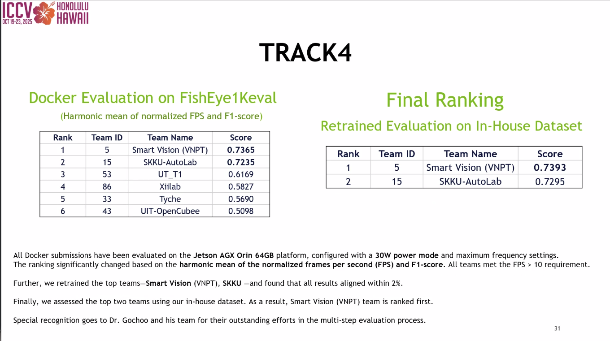

# 9th AI City Challenge - Track 4 (Team 15: SKKU-AutoLab)

🥈 2nd Place Solution of the 9th AI City Challenge, Track 4, ICCV 2025.

📄 [Paper](https://openaccess.thecvf.com/content/ICCV2025W/AICity/papers/Pham_Data_Augmentation_Is_All_You_Need_For_Robust_Fisheye_Object_ICCVW_2025_paper.pdf)
📦 [Code](https://github.com/SKKUAutoLab/aic25_track_04)




## PREREQUISITES 

- Jetson AGX Orin 32GB: nvidia-jetpack (6.1) 
- Operating System: Ubuntu 22.04.5 LTS 
- Docker version 27.5.1
- Please ensure both [Docker & NVIDIA Container Toolkit](https://docs.nvidia.com/datacenter/cloud-native/container-toolkit/1.13.5/install-guide.html) are installed on your machine.


##  TRAINING GUIDE

**NOTICE: Due to file size limitation, please download the full training code (including the data and supporting files) through this link: [Google Drive](https://drive.google.com/file/d/1jAdPiZaQmFaBV28pUxgVhIywFw3JSUcg/view?usp=sharing).**

Please follow the instructions in `team15` folder to run the training code.


##  INFERENCE GUIDE

**NOTICE: Due to file size limitation, please download the full inference code (including the data and supporting files) through this link: [Google Drive](https://drive.google.com/file/d/1OcAkx-xlIdAeBY7wl0Gf2F1GgIpyelXJ/view?usp=sharing).**

Please follow the instructions in `team15_jetson` folder to run the inference code.


## Citation
```bibtex
@INPROCEEDINGS{Pham2025Data,
    author    = {Long Hoang Pham, Quoc Pham-Nam Ho, Duong Khac Vu, Huy-Hung Nguyen, Chi Dai Tran, Duong Nguyen-Ngoc Tran, Tai Huu-Phuong Tran, Ngoc Doan-Minh Huynh, Hyung Joon Jeon, Hyung-Min Jeon, Son Hong Phan, Trinh Le Ba Khanh, Jae Wook Jeon},
    title     = {Data Augmentation Is All You Need For Robust Fisheye Object Detection},
    booktitle = {IEEE/CVF International Conference on Computer Vision Workshop (ICCVW)},
    year      = {2025},
    pages     = {5334--5342},
}
```

## Contact
- If you have any questions, feel free to contact `Long H. Pham` ([longpham3105@gmail.com](longpham3105@gmail.com) or [phlong@skku.edu](phlong@skku.edu))
